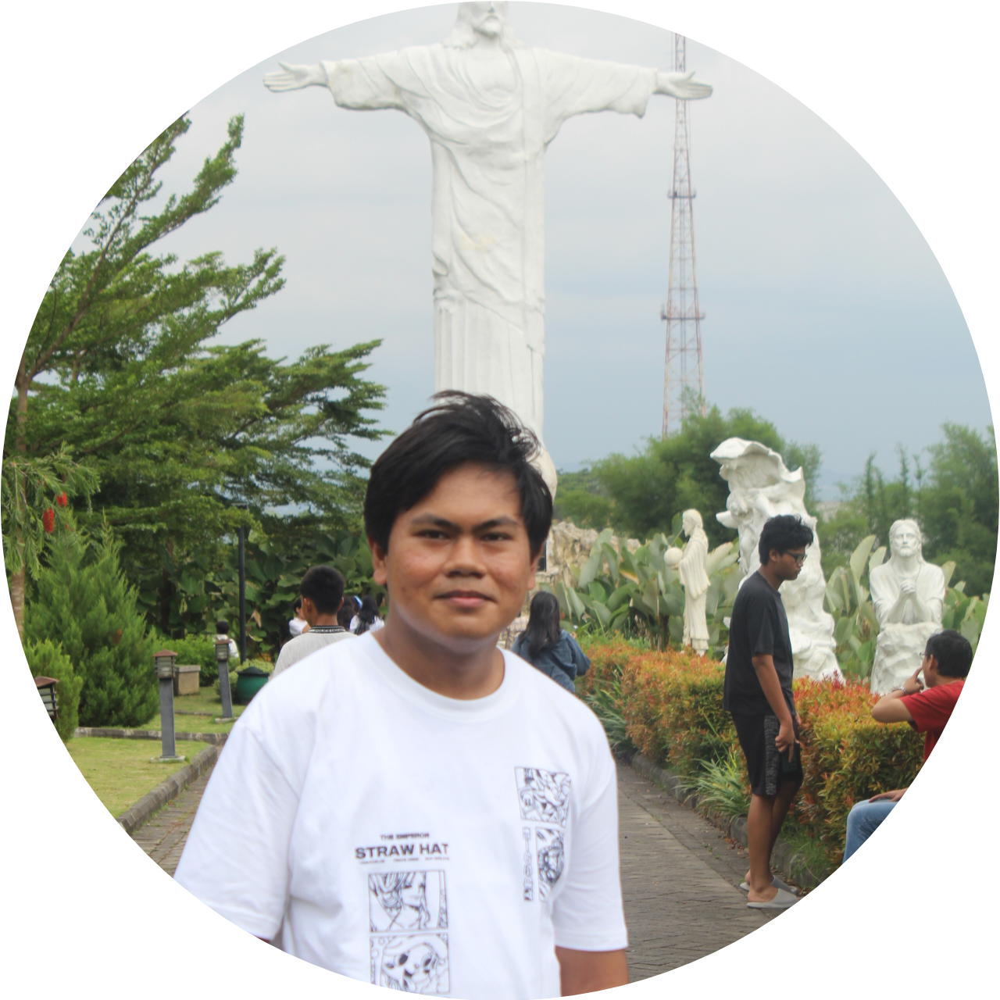
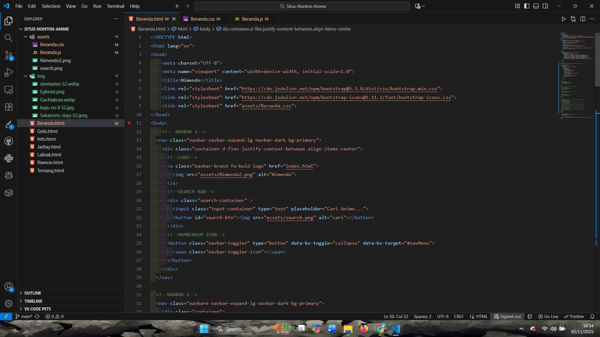
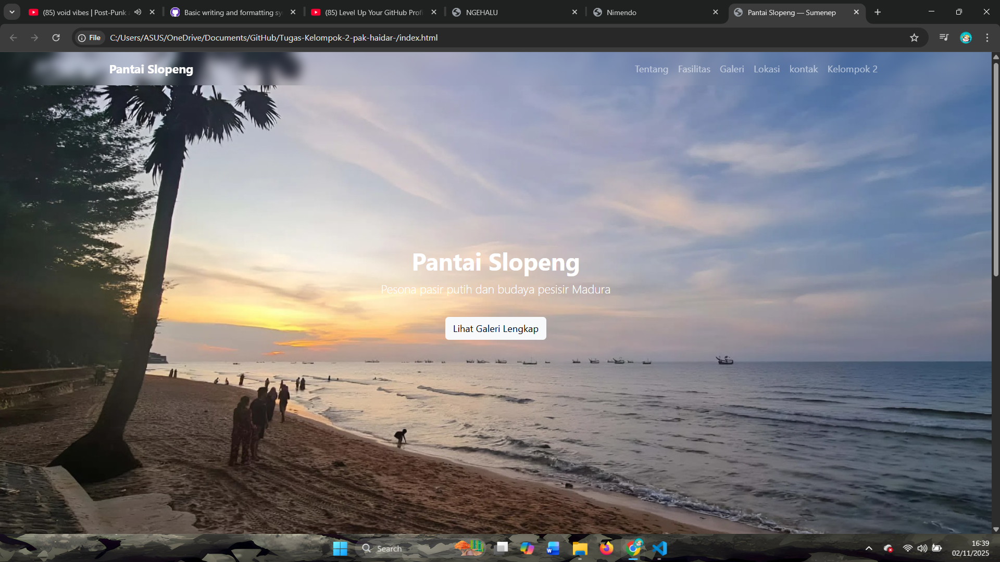
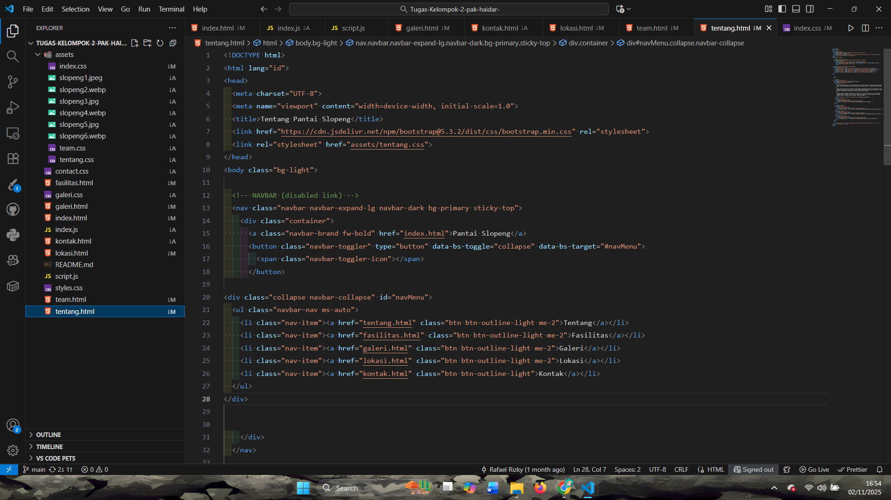
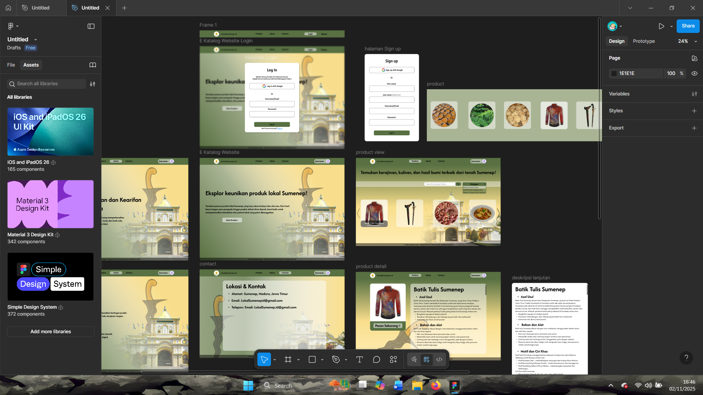
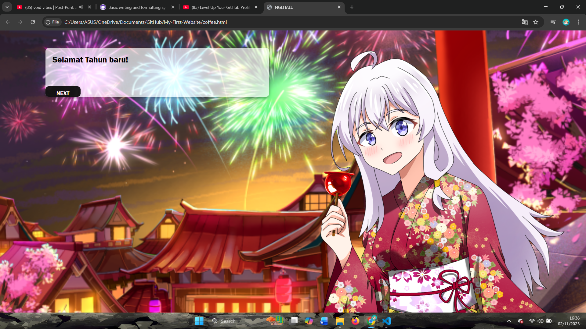
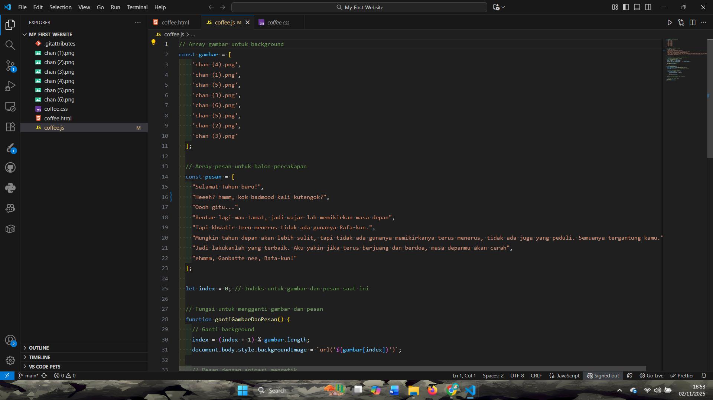

# Portofolio

#
## Rafael Rizky

### Tentang Saya
Saya adalah Mahasiswa Teknik Informatika semester 1 di Politeknik Elektronika Negeri Surabaya yang punya ketertarikan kuat pada pengembangan web. Saat ini saya sedang fokus mempelajari dasar-dasar pemrograman dan sudah memiliki keahlian awal dalam HTML/CSS, JS, Python, C, dasar-dasar Git, dan UI/UX. Saya sangat suka memecahkan masalah dan antusias untuk mengubah ide menjadi kode. Meskipun belum memiliki pengalaman kerja formal, saya sedang mengerjakan proyek situs nonton Anime untuk mengaplikasikan ilmu yang saya dapat. Saya menggunakan LinkedIn untuk membangun portofolio, terhubung dengan para profesional di industri teknologi, dan mencari inspirasi. Saya terbuka untuk belajar dan berdiskusi mengenai teknologi. Jangan ragu untuk terhubung!

### Keahlian
- Pengembangan Web (HTML, CSS, JavaScript
- Bahasa Pemrograman (Python, C)
- Tools (Git, Visual Studio Code)
- UI/UX (Figma)

### Proyek Kolaboratif
#### 🔗 Link Proyek
- **GitHub**: https://github.com/Rafariz19?tab=repositories
- Figma: https://www.figma.com/design/OvUUJPMlEDJXlZGWTTVmeM/Untitled?m=auto&t=V1mtGhApkdLE8tAZ-1

#### 📸 Cuplikan Tampilan
<!DOCTYPE html>
<html lang="en">
<head>
    <meta charset="UTF-8">
    <meta name="viewport" content="width=device-width, initial-scale=1.0">
</head>
<body>
1. Proyek Situs Nonton Anime
    

  

    
  

  

    
  

2. Website Wisata Lokal 
    

  

    
  

  

    
  

3. UI/UX Website E-Katalog Produk lokal
    

  

    

  

4. Website Pertama

  

    
  

  

    
  

</body>
</html>

#### 🎯 Kontribusi Saya
Kontribusi atau peran yang kuambil dari beberapa proyek ini adalah 
- **UI/UX Designer**
  Saya membuat wireframe dan mockup di Figma untuk seluruh halaman aplikasi, sekaligus mengatur sistem tata warna, tipografi, dan icon set. Selain itu, saya melakukan revisi desain berdasarkan feedback dari tim, dan juga membuat prototipe interaktif untuk memudahkan tim frontend dalam mengimplementasikan UI. 
- **Frontend Developer**
  Saya mendesain dan membangun halaman login serta dashboard menggunakan HTML, CSS, dan JavaScript. Saya juga membuat berbagai komponen UI seperti navbar dan card secara responsif, serta menghubungkan tampilan frontend dengan API yang dibuat oleh tim backend. Selain itu, saya mengelola struktur file proyek dan menyusun dokumentasi kode di GitHub.

Beberapa kode yang ku pegang dalam proyek ini adalah kode kode dasar untuk membuat tampilan website seperti HTML, CSS dan JavaScript. Dalam proyek proyek ini masih banyak tantangan yang harus saya hadapi seperti belajar framework dan mengembangkan skill membuat website lebih profesional lagi

## Refleksi Singkat
Sebagai mahasiswa teknik informatika semester awal, saya harus lebih banyak lagi mengembangkan skill coder saya. sembari mengembangkan skill itu saya akan terus membuat proyek baik itu proyek pribadi maupun kolaborasi, dimana itu bisa menjadi aksi nyata yang bisa ditunjukkan kepada orang lain baik itu teman, pihak perusahan maupun tim straup ku nanti di masa depan.

## Kontak Profesional
- Email: yukizuna99@gmail.com
- LinkedIn: https://www.linkedin.com/in/rafael-rizky-luga-304240298/

